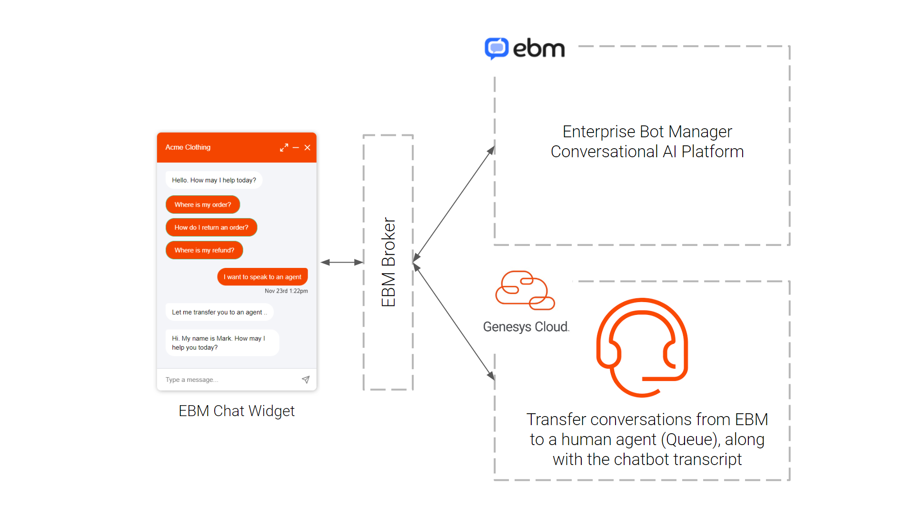

# Setup Guide for connecting EBM (Enterprise Bot Manager) to human agent handover  

This Genesys Cloud Developer Blueprint provides instructions on how to connect EBM (Enterprise Bot Manager) Chat Bots with Genesys Cloud, facilitating handover from chatbot to a human agent at appropriate points within a conversation.  In addition to checking agent availability, the connector passes chatbot transcripts to the agent at transfer. 

### Genesys APIs Used
 - Genesys Authorization APIs
 - Genesys Web Chat Guest APIs

### Setup steps in EBM

Within the EBM Broker interface (basic setup):

 - Create a EBM Fulfilment
 -- Define the pre-existing EBM chatbot to connect to
 
 - Create a Genesys Chat Bridge Connector and populate the following values
 -- Cloud environment (from instance URL e.g. *euw2.pure.cloud*)
 -- Organization ID (from *Genesys Admin -> Account Settings -> Organization Settings -> Organization Details*)
 -- Deployment ID (from *Genesys Admin -> Contact Center -> Widgets*)
 -- Client ID (from *Genesys Admin -> Integrations -> OAuth -> App*) - use **Client ID** 
 -- Client Access Token Secret (from *Genesys Admin -> Integrations -> OAuth -> App*) - use **Client Secret** 
 -- Handover Skill (from *Genesys Admin -> Contact Center -> Queues*) - use **Queue Name**

Within the EBM Conversation Flow:

- Enable "Human Handover" on a flow transition and enter the EBM Fulfilment reference into the "Skill ID" field
